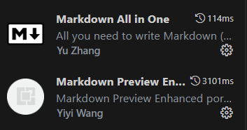

# 技术部文档 

## 1. 项目开发

开发项目：

```
npm start
```

启动后会自动跳转至[http://localhost:3000](http://localhost:3000)。

## 2. 注意事项

### 2.1 前提和基础

首先你需要有使用 Git、Github 的经验，会写 Markdown。

另外，本项目使用的文档框架是[Docusaurus](https://docusaurus.io/)，也是由 Facebook 领导开发的一个开源项目，底层使用的是 React 和 Webpack，开发前建议先阅读一下相关文档。如果你要开发独立的页面，需要了解 React 和 Typescript；如果只是写文档和文章，只需要知道这个框架的结构，会写 Markdown 就可以了。

### 2.2 Mardkown 规范

**安装插件**

写 Markdown 文档或者文章的时候，建议安装这两个插件以保证格式的统一性：



**内容规范**

书写的内容请保证条理性和严谨性，书写的规范请参考已有的文章。

**压缩图片**

在 Markdown 中使用的图片最好先压缩再使用，图片不要超过 1M，建议在 **500K**左右，**越小越好**。你可以使用下面这个免费的在线压缩工具：

- [https://redketchup.io/image-compressor](https://redketchup.io/image-compressor)

### 2.3 格式化代码

提交前请先格式化代码再提交：

```
npm run format
```

## 3. 访问链接

- [https://njtustas.github.io](https://njtustas.github.io)
