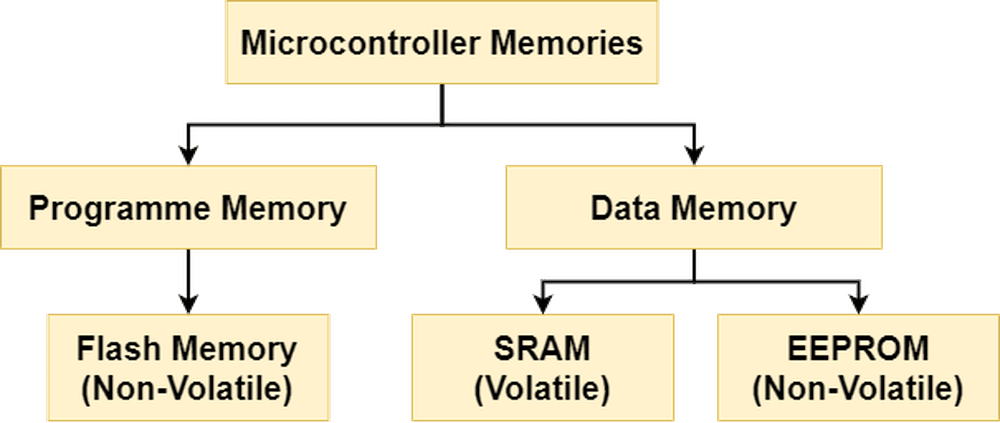
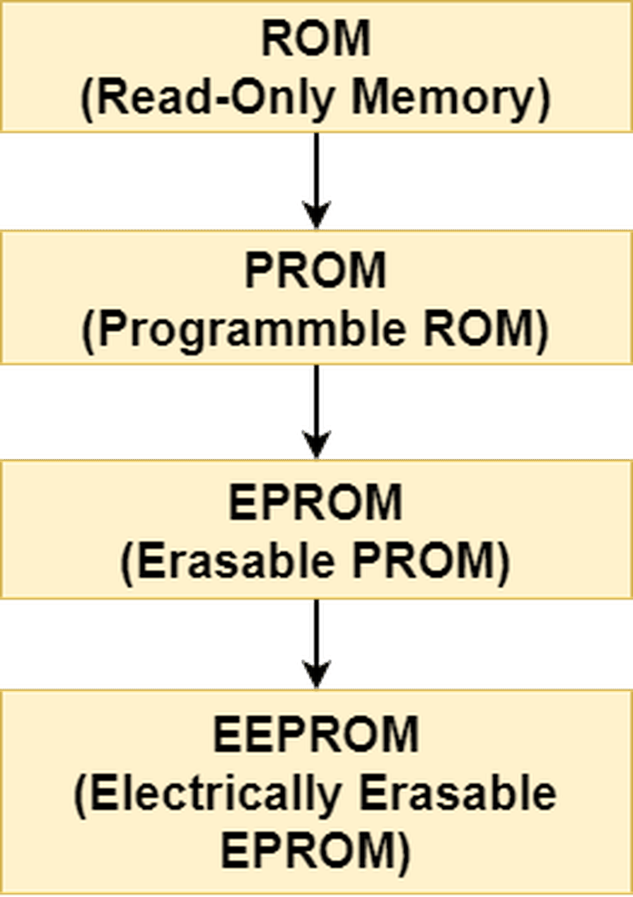

# 单片机的存储器和 EEPROM

## 1. 单片机的存储空间

一般单片机的存储空间可以用下图表示：



单片机中**SRAM(Static Random-Access Memory)**，主要是用于存储程序运行过程中的变量，因为 RAM 拥有读写速度快的优点，但是 RAM 的数据在掉电后会丢失。

**EEPROM(Electrically Erasable Programmable Read-Only Memory)**，也称\\(E^2PROM\\)，指的是**电可擦可编程只读存储器**，主要用于存储重要的用户数据，读写速度比较慢。

EEPROM 的主要特点如下：

- **擦除区域小，一开始只有一个字节，后来支持多字节页擦除**
- **有限的擦写周期，一般是 1000,000 次**
- **能够长期存储数据，掉电后数据也不会丢失**

单片机中的 EEPROM 的由来和发展非常有意思，可以用下面的图表示：



Flash 和 EEPROM 在某些方面比较相似。因为 Flash 就是由 EEPROM 发展而来，支持大擦除块，一般是**512 字节甚至更高**，EEPROM 不仅擦除块小，且每次擦除都需要大概 3.3ms 左右，因此，Flash 更适合用来做为程序储存空间。Flash 和 EEPROM 一样，掉电后数据不会丢失，属于**Non-Volatile Memory**，因此在一些没有 EEPROM 的单片机上，可以使用 Flash 代替 EEPROM，比如 ESP32。但是 Flash 的擦写周期要比 EEPROM 短，通常在**10,000**次。

每次我们编译 Arduino 的代码是，窗口下的终端显示了 SRAM 和 FLASH 的使用情况，也就是变量存储空间和程序存储空间。

## 2. Arduino 的 EEPROM 库

Arduino 的 AVR 单片机的 ATmega328 芯片，拥有**1024 字节**的 EEPROM，ATmega168 和 ATmega8 拥有**512 字节**的 EEPROM，而 ATmega1280 和 ATmega2560 拥有**4096 字节**的 EEPROM。

所以我们经常使用的 Arduino Uno 拥有 1KB 的 EEPROM。

Flash 和 SRAM 大家日常都在使用，下面我们学习如何通过 Arduino 官方的 EEPROM 库读写 EEPROM：

### 2.1 read()

语法：

```cpp
EEPROM.read(address);
```

该函数用于读取 EEPROM 中一个字节的数据，未写过的区域读取的值为 255。

参数 address：EEPROM 中的地址，对于 Uno，就是 0-1023。

### 2.2 write()

语法：

```cpp
EEPROM.write(address, value);
```

该函数用于向 EEPROM 写入一个字节的数据。

参数 address：EEPROM 中的地址，对于 Uno，就是 0-1023。

参数 value：需要写入的数据，数据类型为`uint8_t`。

### 2.3 update()

语法：

```cpp
EEPROM.update(address, value);
```

用法类似于`EEPROM.write(address, value)`，也是向 EEPROM 写入一个字节的数据，只是该函数在写入前会检查写入值和已有值是否相同，不同才会写入。那是因为 EEPROM 有着有限次数的擦写周期，因此建议使用`update`代替`write`。

参数 address：EEPROM 中的地址。

参数 value：需要写入的数据，数据类型为`uint8_t`。

下面是一个使用了 update 和 read 的实例，供大家参考：

```cpp
#include <EEPROM.h>

void setup() {
  uint8_t data = 123;
  int address = 0;

  // Wait open serial monitor
  Serial.begin(115200);
  while (!Serial);

  // Write data to EEPROM
  Serial.print("Write data to EEPROM: ");
  EEPROM.update(data, address);

  // Read data from EEPROM
  Serial.print("\nRead data from EEPROM: ");
  data = EEPROM.read(address);
  Serial.println(data, 3);
}

void loop() {
}
```

### 2.4 put()

语法：

```cpp
EEPROM.put(address, data);
```

作用类似于 write 函数，也是向 EEPROM 写入数据，但该函数支持写入原始的数据类型，不局限于一个字节的数据，可以是`float`、`int`、`String`等。

参数 address：EEPROM 中的地址。

参数 data:：需要写入的数据，可以是原始的数据类型。

### 2.5 get()

语法：

```cpp
EEPROM.get(address, data);
```

作用类似于 read，用于从 EEPROM 读取数据，但该函数支持读取原始的数据类型，不局限于一个字节的数据，可以是`float`、`int`、`String`等。

参数 address：EEPROM 中的地址。

参数 data：需要读取的数据类型。

下面是一个使用了 put 和 get 的实例，供大家参考：

```cpp
#include <EEPROM.h>

void setup() {
  float data = 123.45;
  int address = 0;

  // Wait open serial monitor
  Serial.begin(115200);
  while (!Serial);

  // Write float to EEPROM
  Serial.print("Write float to EEPROM: ");
  EEPROM.put(data, address);

  // Read float from EEPROM
  Serial.print("\nRead float from EEPROM: ");
  EEPROM.get(address, data);
  Serial.println(data, 3);
}

void loop() {
}
```
