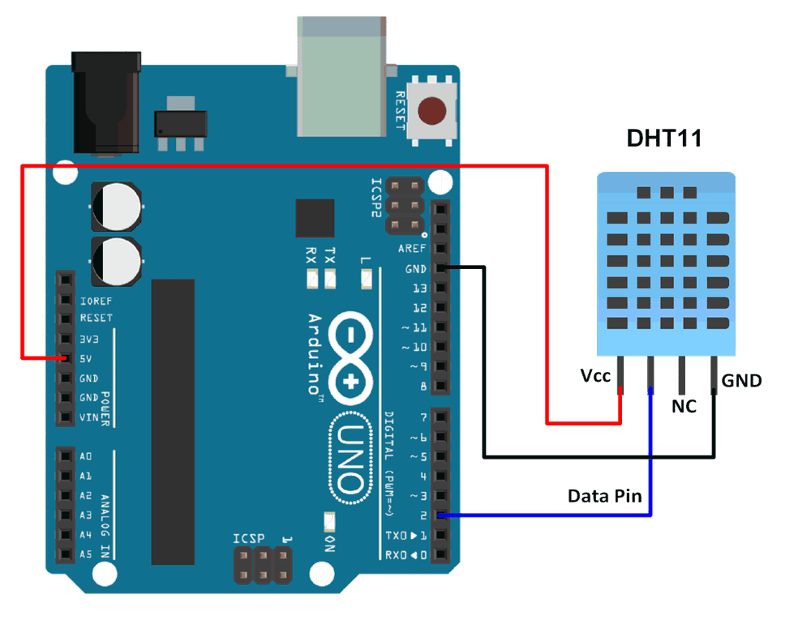
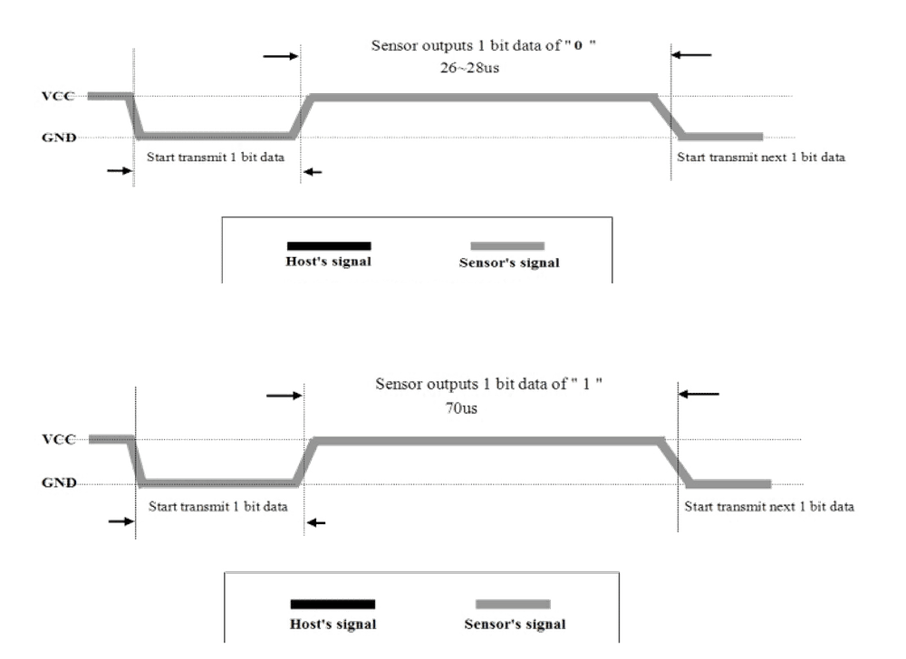
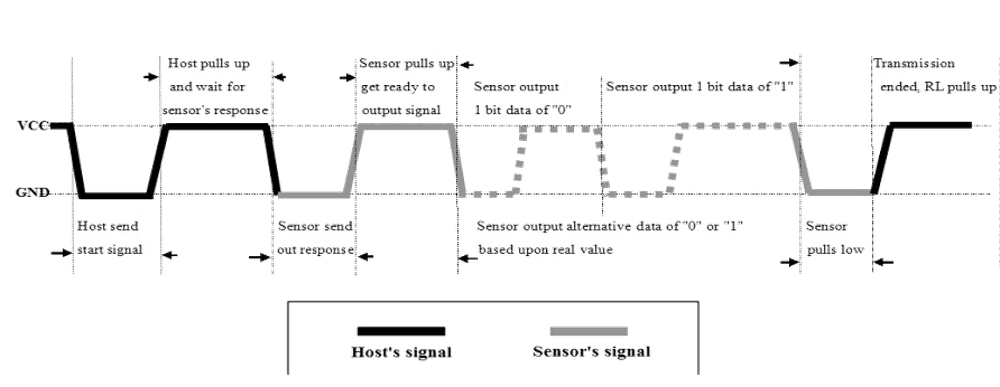

# DHT11 数据手册速览

## 1. DHT11 的基本参数

|   参数   |   参数值    |
| :------: | :---------: |
| 供电电压 |  3.3V-5.5V  |
| 通信方式 |   单总线    |
| 湿度范围 | 20-90%±5%RH |
| 温度范围 |  0-50±2°C   |

## 2. DHT11 引脚接线图

DHT11 有四个引脚，其中一号引脚是电源接口（3.3-5.5V）；二号引脚是数据输入输出接口，数据手册中建议加一个上拉电阻；三号引脚悬空不接；四号引脚接地。

## 3. DHT11 通信中的‘0’和‘1’

根据数据手册的介绍，我们可以总结出 DHT11 发送‘0’和‘1’的规律如下：

**50us 低电平 + 26-28us 的高电平 = ‘0’**

**50us 的低电平 + 70us 的高电平 = ‘1’**

## 4. DHT11 返回的数据包

DHT11 返回的数据包共有 5 个字节，即 40 位的数据，其中包括 16 位的湿度信息，16 位的温度信息以及 8 位的校验和信息。其中湿度和温度的第一个字节是整数位，第二个字节是小数位，每个字节都是高位在前，低位在后。最后一个字节是校验和，**校验和=湿度整数位+湿度小数位+温度整数位+温度小数位**。

下面是 DHT11 返回的数据包示意图：

虽然数据手册上表示湿度和温度的小数位都是 0，但是我在实际操作过程中发现湿度的小数位确实是 0，而温度的小数位不是总是 0，温度有小数位，精度为 0.1。正因如此，导致我在验证校验和的时候通过**湿度整数位+温度整数位!=校验和**总是返回**DHT11_ERROR**。

所以说权威也有错误的时候，我们需要有一颗会怀疑的心，想办法证明自己。

## 5. DHT11 和 MCU 的通信过程

第一步，信号线正常情况下处于被拉高状态，MCU 需要拉低信号线至少 18ms，再拉高至少 20-40us，发送开始信号，然后等待 DHT11 应答。

第二步，DHT11 接收到开始信号后会先拉低信号线 80us，再拉高 80us，表明 DHT11 准备好了，MCU 可以开始准备接受数据了。

第三步，接着 DHT11 将发送 40 位的数据包，发送完之后就再次把信号线拉高，通信结束。

值得注意的是，数据手册上说明了 DHT11 采集更新数据需要 2 秒钟，因此我建议每次和 DHT11 结束通信后至少**延时 3 秒钟**，保证数据的准确性。

