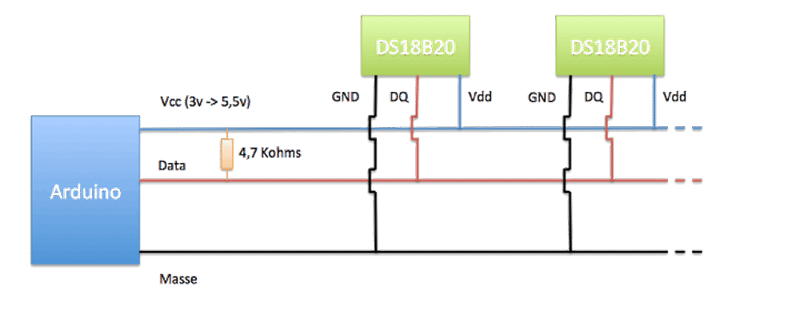

# One-Wire 简介

## 1. 什么是单总线通信

单总线通信是单片机通信中最基础，接线最简单的一种通信方式，字面意思就是只通过一根线进行的通信方式，单片机只需要一个 IO 口就可以和设备进行通信。

也正因为如此，单总线通信也是其他通信当中通信速度最慢，最容易丢失数据，它的速度上限是**16.3 kbit/s**。并且没有相对统一标准的一种通信方式，因此大部分设备的硬件通信都需要手动编写。

## 2. 单总线通信的外设

正常情况下我们需要将通信接口拉高以保证数据的稳定。同时可能还需要在电源之间接一个电容进行滤波。

