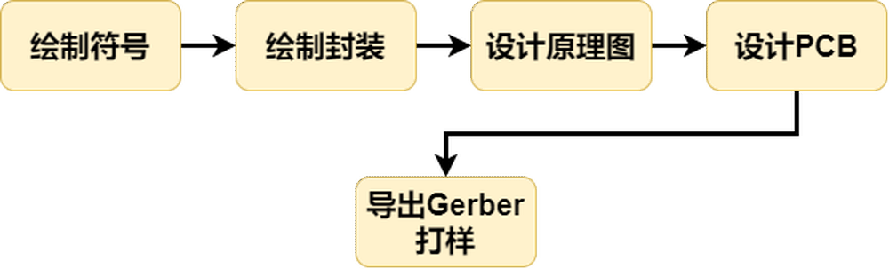

# EDA 入门简介

## 1. 什么是 EDA

EDA 即 **Electronic design automation(电器设计自动化)** 的简称。是通过 **CAD(计算机辅助设计)** 软件来完成超大规模集成电路芯片的功能设计、综合、验证、物理设计（包括布局、布线、版图、设计规则检查等）等流程的设计方式。

常见的 EDA 设计软件有：

- Protel
- Altium Designer
- Matlab
- KiCad
- LCEDA

## 2. EDA 设计流程

## 3. 章节内容

- [555 计时器](./chapter1.md)
- [绘制符号和封装](./chapter2.md)
- [设计原理图](./chapter3.md)
- [设计 PCB](./chapter4.md)
