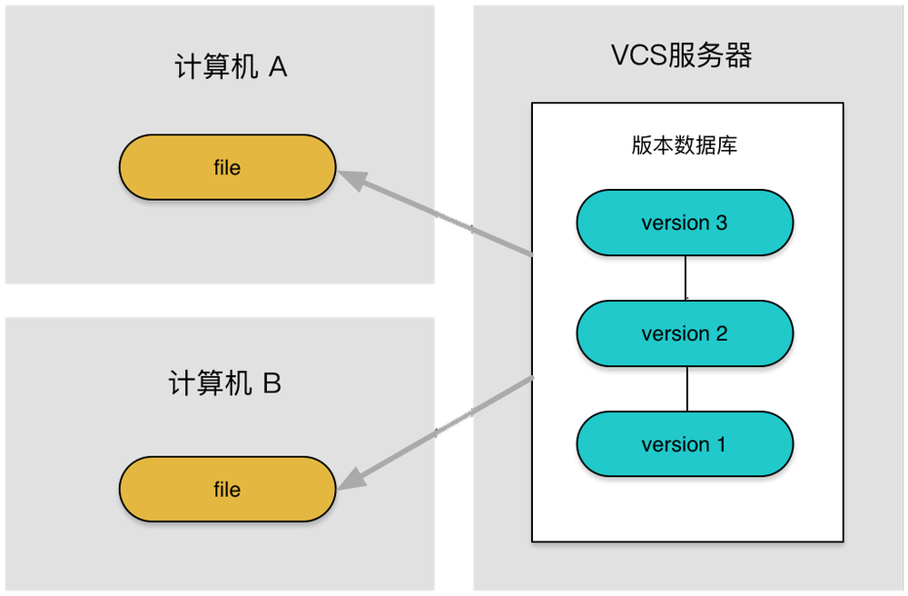
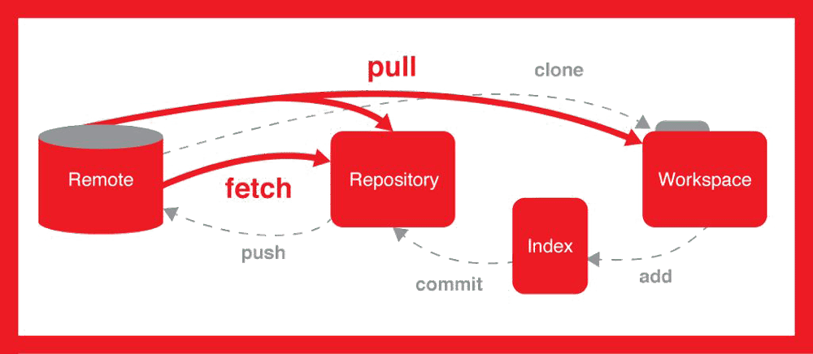

# 集中式 VS 分布式

## 1.版本控制系统的联系与区别

在软件开发过程中，**协同开发以及版本迭代更新**是再正常不过的事情了。但是能够完整、便捷的将版本进行管理确是不太容易的一件事情。

就好比，一个项目，我们开发了第一版、第二版、第三版、打死不改版、绝对不改版、终极版、终极不修改版以至于再改就砸电脑版，最终敲定的方案是第一版。这种情况下，改到最后已经看不出当初的模样了。所以，我们需要将每一次的修改记录并保存下来，以便于为后面的版本溯源。

凡事都是有两面性的，作为版本保存和记录的软件系统也是一样的。所以就诞生了两种不同的管理模式，一种是叫**集中式版本控制系统**（例如 CVS 及 SVN），另一种则是**分布式版本控制系统**（例如 Git）。

## 2.集中式版本控制系统

集中式的版本控制系统，所有的版本库是放在中央服务器中的，也就是说我们每一次的修改上传都是保存在中央服务器中的。中央服务器就是个大仓库，大家把产品都堆里面，每一次需要改进和完善的时候，需要去仓库里面把文件给提出来，然后再操作。

这种版本管理模式，**存在的问题是协同工作时可能造成的提交文件不完整，版本库损坏等问题**，A 提交，B 也提交，C 下载的时候可能得到的仅是 A,B 提交版本中的一部分。其次，**集中式版本控制系统必须要联网才能工作**，不论是局域网还是互联网，必须上网才能将本地版本推送至服务器进行保存。

## 3.分布式版本控制系统

分布式版本控制系统，**重点在于分布**。分布的含义不是说每台计算机上只留有版本库的一部分。恰恰相反，分布的含义是**每台计算机上都还有一个完整的版本库**。这个时候，你的修改仅仅需要提交给本地的版本库进行保存就可以了。

不同于集中式版本控制系统的“中央服务器”，分布式版本控制系统可以通过推送版本库，实现不同的计算机之间的版本共享。就是说对于同一个文件 A，如果两个人同时对 A 文件进行了修改，最新的版本应该都保存在各自的计算机中，想要实现协同开发，只需要将各自的最新版本库推送给对方，就可以得到最新的版本库了。

