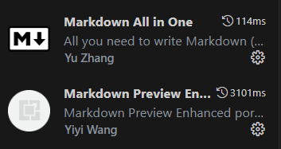

# 说明

## 1. 项目背景

这是我给我们技术部搭的文档，我已经把我之前写的电子组的文档搬过来了，还写了一篇有关我们[义务维修海报](/blog/stas-pc-maintenance-history)的文章，海报内容搜集不全，希望大家可以补充。

做这个文档的目的也是把我们搁置已久的 [GitHub 组织](https://github.com/NJTUSTAS)
利用起来，同时也是记录我们在技术部的历程，毕竟放在 GitHub 上的数据几乎是不会丢失的，就算我们毕业了也可以看到大家的过去和现在的动态。

我非常希望大家能够参与到这个文档项目中，任何人都可以写自己想写的内容，各个组也可以写写自己的组的文档、活动和杂文，都可以的。毕竟只有大家参与才有可能让我们这个组织更有力量，我一个人写不了太多东西。

参与的门槛不高，能**翻墙**（巨佬给我们配的办公室网络自带翻墙），会使用 **Git**，和 **GitHub**，会写 **Markdown** 就可以了（我觉得在技术部，会点这个还是不难的，这个应该和义务维修一样，是大家的基本技能，也可以请教请教周围的人）。不会的话现在可以学起来，值班的时候上 Google 上了解了解，和其他人交流交流。

最后，大家想参与这个项目，并且有自己的想法，可以先把上面提到的技能学起来，尝试在本地练一练，然后找你们的组长会或者群里的管理员拉你们进入我们技术部的 GitHub 组织，他们或多或少已经在了。

非常希望大家能够积极参与进来。

## 2. 项目开发

安装 Git，前往 [Git 官网](https://git-scm.com/downloads)下载安装。

安装 Node，需要有 Node16 及以上的版本，建议安装 **Node18**，你可以前往 [Node 官网](https://nodejs.org)下载安装。

克隆项目：

```sh
git clone https://github.com/NJTUSTAS/njtustas.github.io.git
```

开发项目：

```sh
npm start
```

启动后浏览器会自动跳转至[http://localhost:3000](http://localhost:3000)。

## 3. 注意事项

### 3.1 开发基础

首先你需要有使用 Git、Github 的经验，会写 Markdown。

另外，本项目使用的文档框架是[Docusaurus](https://docusaurus.io/)，也是由 Facebook 领导开发的一个开源项目，底层使用的是 React 和 Webpack，开发前建议先阅读一下他们的文档。如果你要开发独立的页面，需要了解 React 和 Typescript；如果只是写文档和文章，只需要知道这个框架的结构，会写 Markdown 就可以了。

### 3.2 Markdown 规范

**安装插件**

写 Markdown 文档或者文章的时候，建议安装这两个插件以保证格式的统一性：



**内容规范**

书写的内容请保证条理性和严谨性，书写的规范请参考已有的文章。

**压缩图片**

在 Markdown 中使用的图片一定要**先压缩再使用**，图片不要超过 1M，建议在 **500K**左右，**越小越好**。你可以使用下面这个免费的在线压缩工具：

:::info
[https://redketchup.io/image-compressor](https://redketchup.io/image-compressor)
:::

### 3.3 文件创建

创建的每一个文章应该以和文章内容相近的**英文命名**，不要使用中文命名。

### 3.4 Sidebar 链接

项目的 Sidebar 应该在`config/sidebar`中相关的 Sidebar 文件导出，然后再在根目录的`sidebar.js`中导入。

例如电子组的 Sidebar 路径是`config/sidebar/electronics.js`：

```js
const electronics = [
  {
    type: "category",
    label: "电子组文档",
    collapsed: true,
    items: [
      {
        type: "doc",
        id: "electronics",
        label: "说明"
      },
      {
        type: "category",
        label: "Arduino",
        items: [
          {
            type: "doc",
            id: "electronics/arduino",
            label: "Arduino简介"
          },
          ...
        ]
      },
      ...
    ]
  },
  ...
]

module.exports = electronics;
```

然后在 sidebar.js 中导入：

```js
const electronics = require("./config/sidebar/electronics");

/** @type {import('@docusaurus/plugin-content-docs').SidebarsConfig} */
const sidebars = {
  docs: [
    {
      type: "doc",
      label: "说明",
      id: "intro"
    },
    ...electronics
  ]
};

module.exports = sidebars;
```

这么也是为了让目录结构更加清晰，Sidebar 中的每一个元素我们都可以自己定义，这样生成的目录就会按照我们想要的顺序排列了。详细内容可以参考[官方文档](https://docusaurus.io/docs/create-doc)。

:::tip
如果你实在看不懂文档可以参考我已经写好的嘛，还是不明白的话可以联系我。
:::

### 3.5 格式化代码

提交前请先格式化代码再提交：

```
npm run format
```

## 4. 结束语

非常希望大家可以参与进来，给科协的过去和未来留下点东西。
